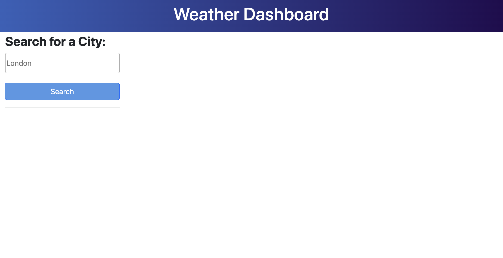

# Weather Dashboard

A 5 day weather forecast for multiple cities.

## Description

The project represents an application that allows users to see the weather forecast for cities of their choosing.

The application has the following functionalities:

- The user can input a city of their preference in the search field
- Once they tap on the "Search" button, the application stores the searched city in the local storage and renders this information in the form of a button on the page
- For each searched city, the application offers information on the current weather and a 5-day forecast, retrieved from the OpenWeatherMap API
- The user can tap on the grey buttons to access the weather on previously searched city

## Usage

The webpage can be accessed using this URL: https://anadomuta.github.io/challenge-weather-dashboard/

The screenshots below display an overview of the application.

## Credits

The project was built following the instructions from the materials in the Skills Bootcamp in Front-End Web Development by edX.

In addition, the following resources were used:

1. Bootcamp content: exercises on OpenWeatherMap API, server APIs
2. Tutoring session: use of template literals to dynamically generate Bootstrap cards, getting weather icons from API
3. MDN Web Docs: [Template literals](https://developer.mozilla.org/en-US/docs/Web/JavaScript/Reference/Template_literals)
4. W3School Article: [CSS Gradients](https://www.w3schools.com/css/css3_gradients.asp)
5. Online tool to find colours: [RedKetchup | Color Picker](https://redketchup.io/color-picker)
6. Markdown badges from [ileriayo](https://github.com/Ileriayo/markdown-badges?tab=readme-ov-file#markdown-badges)

## License

This project is licensed under the terms of the MIT license.

## Badges

